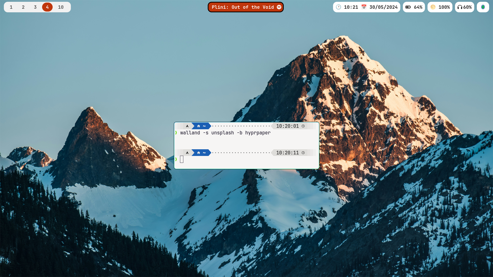

# Walland

Sets as wallpaper on Hyprland the picture of the day of different sources using `hyprpaper`.

The sources are:

- [Bing](https://www.bing.com)
- [Earth Science Picture of the Day](https://epod.usra.edu/)
- [NASA Earth Observatory](https://earthobservatory.nasa.gov/topic/image-of-the-day)
- [NASA](https://www.nasa.gov/multimedia/imagegallery/iotd.html)
- [Unsplash](https://unsplash.com)
- [NASA Astronomy Picture of the Day](https://apod.nasa.gov/apod/astropix.html)

## Install

```bash
sudo cp ./walland.py /usr/bin/walland
```

## Dependencies

- [hyprpaper](https://github.com/hyprwm/hyprpaper): used to set the image as wallpaper

### Options

```bash
usage: walland.py [-h] [-s SOURCE] [-S] [-D]

Walland sets as wallpaper the picture of the day of different sources using hyprpaper.

options:
  -h, --help            show this help message and exit
  -s SOURCE, --source SOURCE
                        Source of the picture of the day. Default: random. Available sources: bing, unsplash, national-geographic, nasa, apod, earthobservatory, epod
  -S, --save            Save the picture of the day in the current directory.
  -D, --debug           Print debug information.
```

## Screenshots


